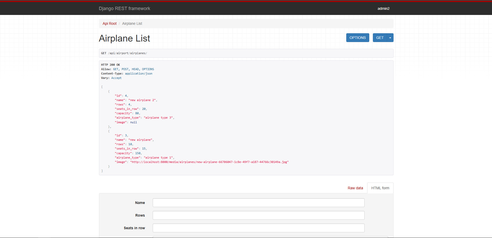
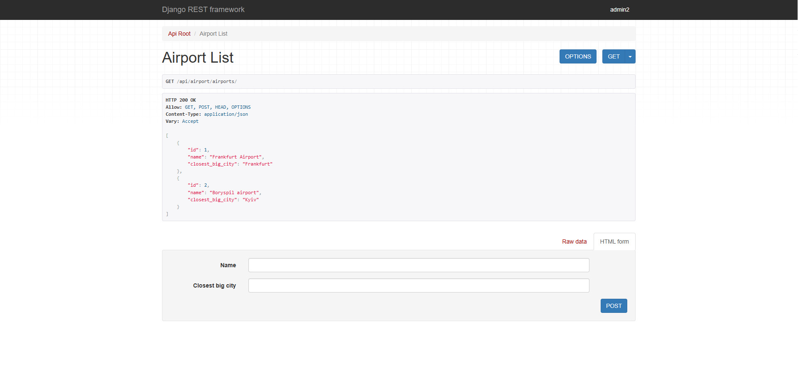
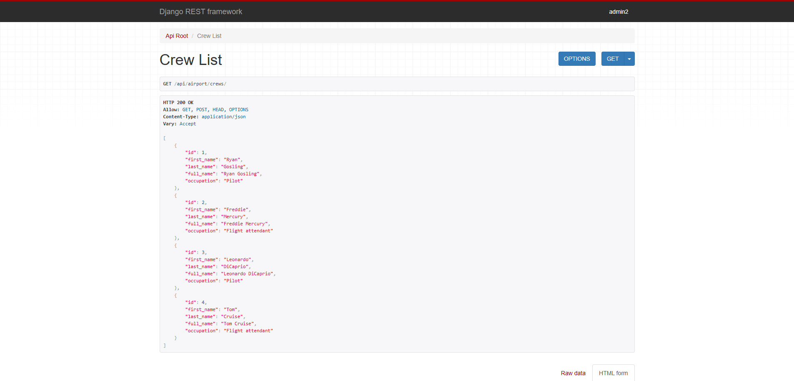
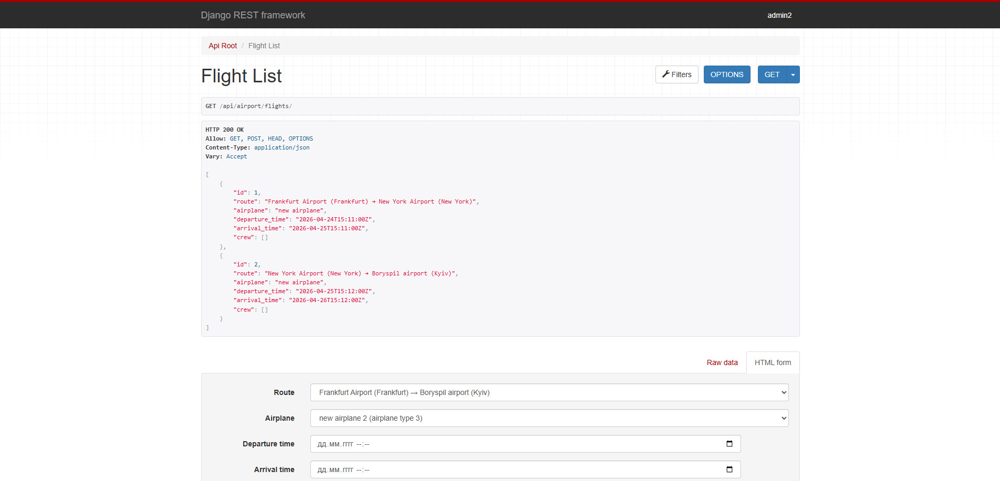
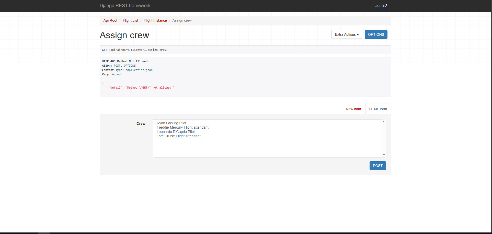
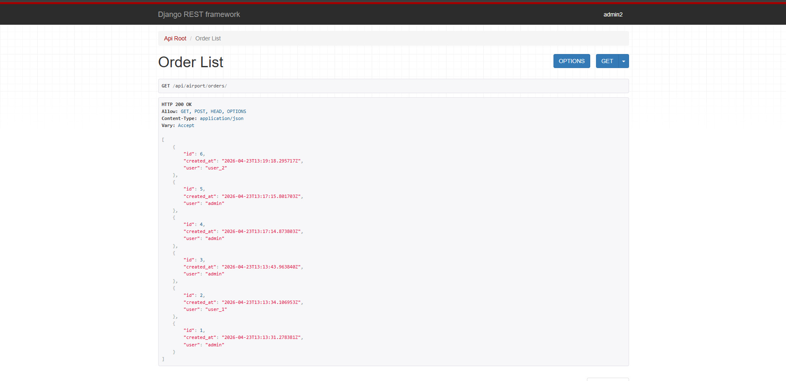
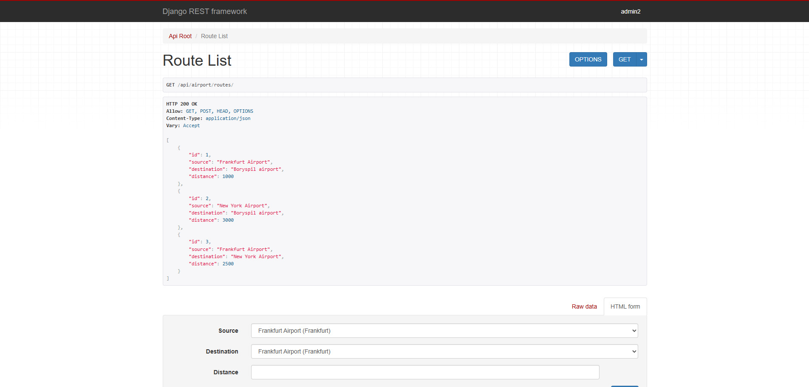
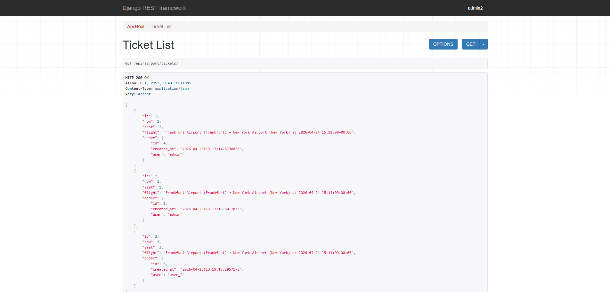

#  Airport API Service

A robust RESTful API for managing airport operations, flight scheduling, ticket bookings, and crew assignments. Built with **Django REST Framework** and fully **Dockerized**.

##  Features

- **Flight Management:** Complete CRUD for routes, airplanes, and flights.
- **Booking System:** Ticket reservations with automated seat/row validation.
- **Crew Allocation:** Manage and assign crew members to specific flights.
- **Authentication:** Secure access using **JSON Web Tokens (JWT)**.
- **Documentation:** Interactive API schema provided by **Swagger** and **Redoc**.
- **Resilience:** Custom `wait_for_db` command to ensure smooth container startup.

##  Tech Stack

- **Framework:** Django & Django REST Framework (DRF)
- **Database:** PostgreSQL
- **Auth:** Simple JWT
- **Docs:** DRF Spectacular (OpenAPI 3.0)
- **Containerization:** Docker & Docker Compose

##  Getting Started

### 1. Clone the repository
```bash
git clone https://github.com/Dolteriska/Airport-api
cd Airport-api
python -m venv venv
source venv/bin/activate
```
### 2. Create a .env file in the root directory and fill it with your credentials. You can use the following template:
```
SECRET_KEY=your_secret_key
DEBUG=True
ALLOWED_HOSTS=localhost,127.0.0.1
POSTGRES_DB=airport_db
POSTGRES_USER=postgres
POSTGRES_PASSWORD=postgres
DB_HOST=db
DB_PORT=5432
```
### 3. Ensure you have Docker installed, then run:

```Bash
docker-compose up --build
```

The service will wait for the database to be ready, apply migrations, and start the server at http://localhost:8000

Once the server is running, you can explore the API endpoints:

Swagger UI: http://localhost:8000/api/dock/swagger/

Redoc: http://localhost:8000/api/doc/redoc/

### Authentication & Permissions
Create a superuser:

```Bash
docker-compose exec app python manage.py createsuperuser
```
Public Access: User Registration (/api/user/register/).

Private Access: Every endpoint requires a user registration.

Admin Access: Only staff can manage Airports, Airplanes, and Crew. Only staff can see crew and airplane lists.

To use protected endpoints, obtain a token:

POST to /api/user/token/ with your credentials.

Include the token in your headers (you can use Modheader extension): Authorization: Bearer <your_access_token>.

### Throttling Limits
To ensure stability, the following limits are applied:

Anonymous users: 10 requests/minute.

Authenticated users: 1000 requests/day.

Registration: 3 attempts/minute.

### Screenshots
* airplane list: 
* airport list: 
* crew list: 
* flight list: 
* flight assign crew: 
* order list: 
* route list: 
* ticket list: 

## **Note**
All screenshots were taken from perspective of admin/staff. API can look different for normal users
